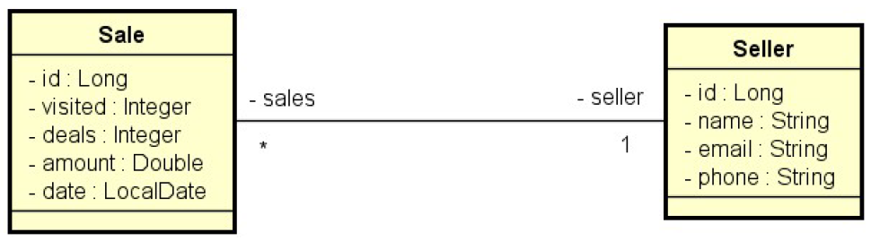

# Study • Consultas SQL e JPQL - API
Trata-se de um sistema de vendas (Sale) e vendedores (Seller). Cada venda está para um vendedor, e um vendedor pode ter várias vendas.

## 🚀 Tecnologias Utilizadas
- Java 21
- Spring Boot
- Maven
- JPA / Hibernate
- H2 Database

## 🎯 Objetivo do Projeto
Este projeto foi desenvolvido com foco em estudos, praticando os principais conceitos do Spring Boot para consultas SQL e JPQL com paginação e filtros dinâmicos.

Funcionalidades implementadas:

#### Relatório de vendas

1. Entrada (opcional):
   - Data inicial
   - Data final
   - Trecho do nome do vendedor
2. Saída:
   Listagem paginada contendo:
   - ID
   - Data
   - Quantia vendida
   - Nome do vendedor

- Regras:
  - Se data final não for informada → usar data atual
  - Se data inicial não for informada → usar 1 ano antes da data final
  - Se nome não for informado → usar texto vazio

#### Sumário de vendas por vendedor

1. Entrada (opcional):
   - Data inicial
   - Data final
2. Saída:
   - Nome do vendedor
   - Soma total de vendas no período

(Segue as mesmas regras de datas do relatório anterior)

## 📁 Estrutura do Projeto

```
src/
└── main/
  └── java/
  | └── com.devsuperior.dsmeta/
  |   └── controller/
  |   └── dto/
  |   └── entities/
  |   └── projections/
  |   └── repository/
  |   └── service/
  |   └── DsmetaApplication.java
  |
  └── resources/
      └── application.properties
      └── import.sql
```


## 🗂️ Diagrama do Projeto





## ⚙️ Como Executar

1. Clonar o repositório 
```
git clone https://github.com/romuloptmota/study-spring-consulta-sql-jpql-api-04
```
2. Abra o projeto em sua IDE favorita (IntelliJ recomendado)
3. Execute a aplicação pela classe:
```
DsmetaApplication.java
```
4. Faça as requisições usando:
   
   - Postman
   - Insomnia
   - ThunderClient (VS Code)

O banco H2 é carregado automaticamente e um script import.sql popula os dados iniciais.

## 📌 Endpoints (se for API)

```
GET  /sales/{id}

GET  /sales/report
GET  /sales/report?minDate=2022-05-01&maxDate=2022-05-31&name=odinson

GET  /sales/summary
GET  /sales/summary?minDate=2022-01-01&maxDate=2022-06-30
```

## 📄 Licença
Este projeto é apenas para fins de estudo e não possui fins comerciais.


